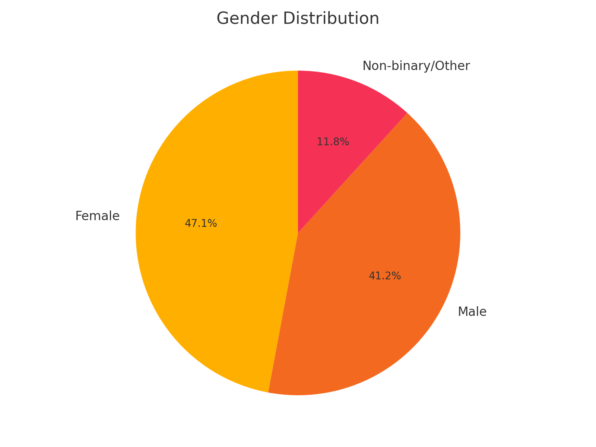
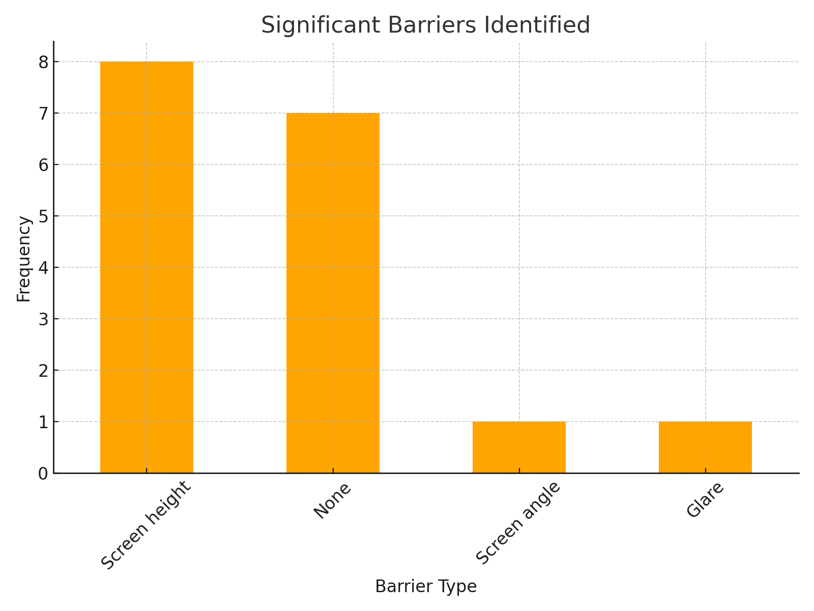
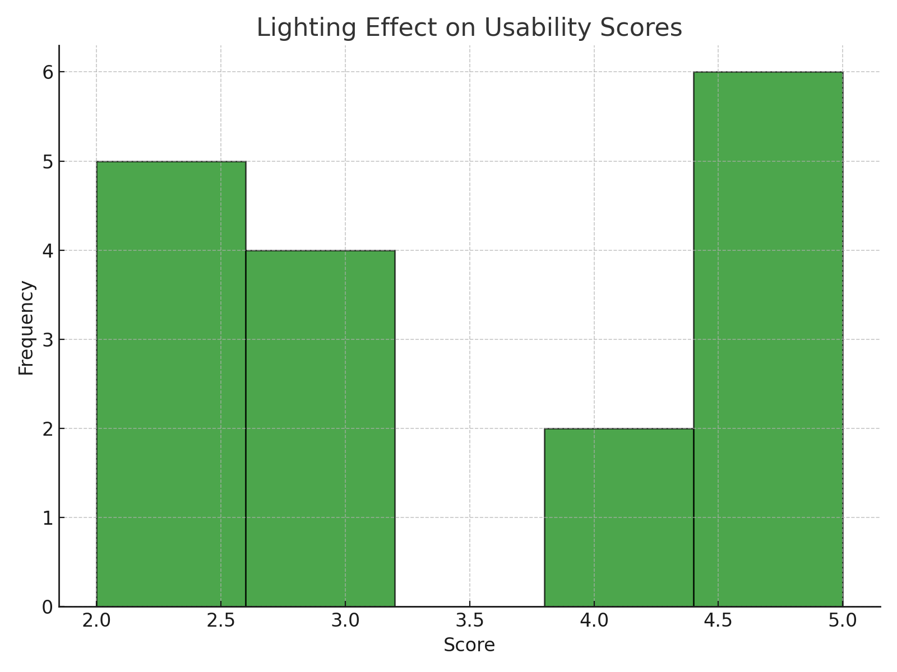

# Accessibility Design of McDonald's Kiosks

---

## Introduction

### Context and Importance
Self-service kiosks have become central to fast-food operations, enabling faster service, reduced employee workload, and enhanced user autonomy. However, these systems, widely implemented by 2020, often neglect critical accessibility needs. This oversight not only alienates marginalized groups but also conflicts with established accessibility standards such as the ADA (2010).

McDonald's kiosks represent a microcosm of broader accessibility challenges in public systems. Despite their potential for improving service efficiency, these kiosks:
- Feature fixed, vertical designs that disregard diverse user needs.
- Prioritize brand aesthetics over usability.
- Lack meaningful adjustments for height, tilt, or glare.

### Objectives
1. **Evaluate Physical Design**: Assess screen height, viewing angles, and usability against ADA guidelines.
2. **Analyze Interface Accessibility**: Examine menu structure, error recovery, and visual ergonomics.
3. **Propose Design Improvements**: Recommend cost-effective solutions to enhance inclusivity and usability.

---

## Methodology

### Approach
#### Measurement-Based Evaluation
1. **Physical Dimensions**:
   - Screen height from ground: Measured at 104 cm (40.9 inches), exceeding ADA's reach range of 15–48 inches for wheelchair users.
   - Kiosk height: 172 cm (67.7 inches), inaccessible to many users.
   - Screen angle: Fixed vertical, amplifying glare under fluorescent lighting.
2. **Interface Evaluation**:
   - Steps to complete an order, including upsells and payment.
   - Error recovery mechanisms, UI element sizes, and language options.
3. **Environmental Factors**:
   - Glare under store lighting, space constraints, and noise levels impacting usability.

### Tools and Data Collection
- Measuring tape for physical attributes.
- Digital level app for screen angles.
- Surveys distributed among college students and older participants (ages 30–49, 65+).

### Ethical Considerations
- Avoided direct testing with marginalized groups to prevent exploitation.
- Relied on measurable characteristics and observational data.

---

## Results

### Age Group Distribution

#### Insights:
- Majority (18–29) aligns with the college environment, but representation from older age groups ensures broader perspectives.
- Older participants (30–49, 65+) provide critical insights into mobility and visual accessibility challenges.

---

### Gender Distribution

#### Insights:
- Balanced gender representation ensures diverse feedback.
- Slight female majority may reflect trends in reporting usability challenges.

---

### Assistive Device Usage

#### Insights:
- Minority of respondents using assistive devices highlights specific barriers like screen height and glare.
- Reinforces the importance of designing for universal usability.

---

### Significant Barriers Identified

#### Insights:
- "Screen height" is the most frequently reported issue, followed by "screen angle."
- Fixed, vertical designs create systemic barriers for wheelchair users and shorter individuals.

---

### Interface Intuitiveness Scores

#### Insights:
- Majority rated the interface highly intuitive (scores 4–5), but lower scores indicate challenges in error recovery and navigation.

---

### Lighting Effect Scores

#### Insights:
- Favorable scores overall, but persistent glare issues highlight the need for matte screens or better positioning.

---

### Average Usability Scores by Barrier

#### Insights:
- Physical ease scores are lowest for "screen height," emphasizing the need for ergonomic redesigns.
- Intuitiveness and visibility are less affected by physical barriers but still warrant improvement.

---

## Discussion

### Key Design Failures
1. **Physical Inaccessibility**:
   - The fixed height (172 cm) violates ADA reach standards, creating barriers for wheelchair users and shorter individuals.
   - Payment modules are inconsistently placed, further complicating usability.
2. **Glare and Viewing Angles**:
   - Vertical screens amplify glare, contradicting ADA Section 309.4's emphasis on "minimized glare and ease of use."
3. **Interface Limitations**:
   - Error recovery options remain insufficient for users with dexterity issues.
   - Steps to complete orders are unnecessarily complex.

### Comparative Design Analysis
#### Employee vs. Customer Interfaces
- **Employee Terminals**: VESA mounts allow height and tilt adjustments, demonstrating feasibility for similar customer-facing designs.
- **Menu Boards**: Angled displays ensure visibility across diverse heights, unlike vertical customer-facing kiosks.
- **Table-Height Terminals**: Fully ADA-compliant, these designs highlight the inconsistency in McDonald's accessibility approach.

### Broader Implications
- Accessibility updates post-2021 reflect a reactive, rather than proactive, approach to inclusivity.
- Prioritizing aesthetics and cost savings over functionality has long-term consequences for brand inclusivity and user satisfaction.

---

## Recommendations

### Physical Improvements
1. **Adjustable Screen Mounts**:
   - Introduce height and tilt adjustability to meet ADA's 15–48 inch reach range.
   - Adopt VESA-compatible mounts, standard in ergonomic design.
2. **Matte Screens**:
   - Implement anti-glare surfaces to enhance visibility under various lighting conditions.

### Interface Enhancements
1. **Simplified Workflows**:
   - Reduce the number of steps to complete orders, minimizing cognitive load.
2. **Integrated Accessibility Features**:
   - Voice guidance, tactile feedback, and larger UI elements.

### Environmental Adjustments
- Reposition kiosks to minimize glare and ensure adequate maneuvering space.

---

## Conclusion

### Summary
- McDonald's kiosks exhibit systemic accessibility gaps, particularly in physical design and interface usability.
- Addressing these flaws will align the systems with ADA standards and enhance inclusivity.

### Future Directions
- Expand evaluations to other kiosk designs and environments.
- Collaborate with accessibility experts for design validation.
- Test proposed improvements in real-world settings, focusing on usability for individuals with disabilities.

---

## References
1. ADA Standards for Accessible Design (2010), Sections 308 and 309.
2. Observational data and empirical survey results.
3. Comparative benchmarks: employee terminals, menu boards, and table-height stations.

