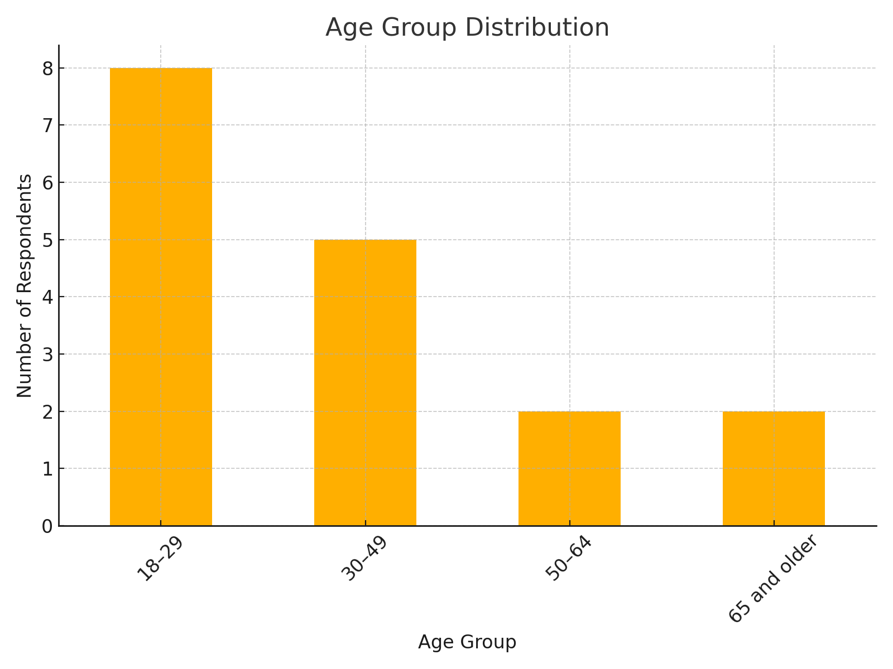
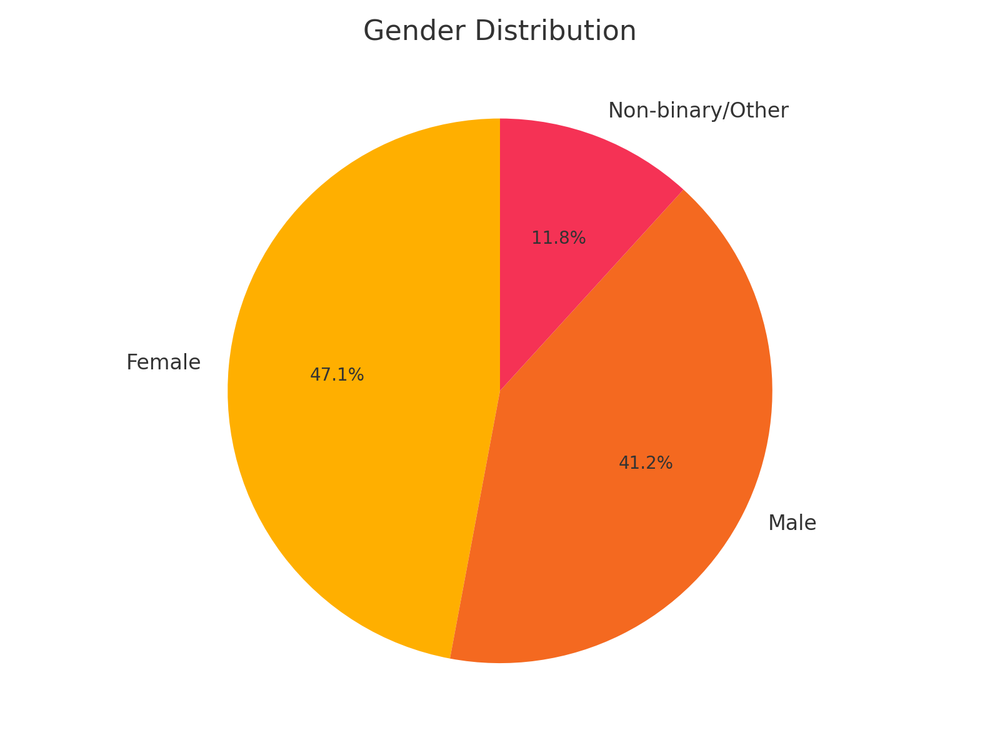
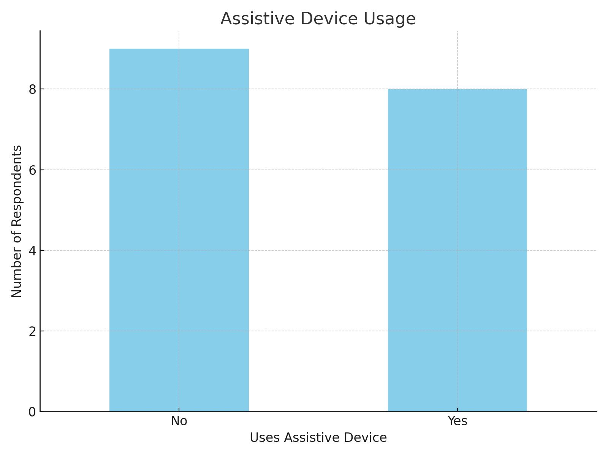
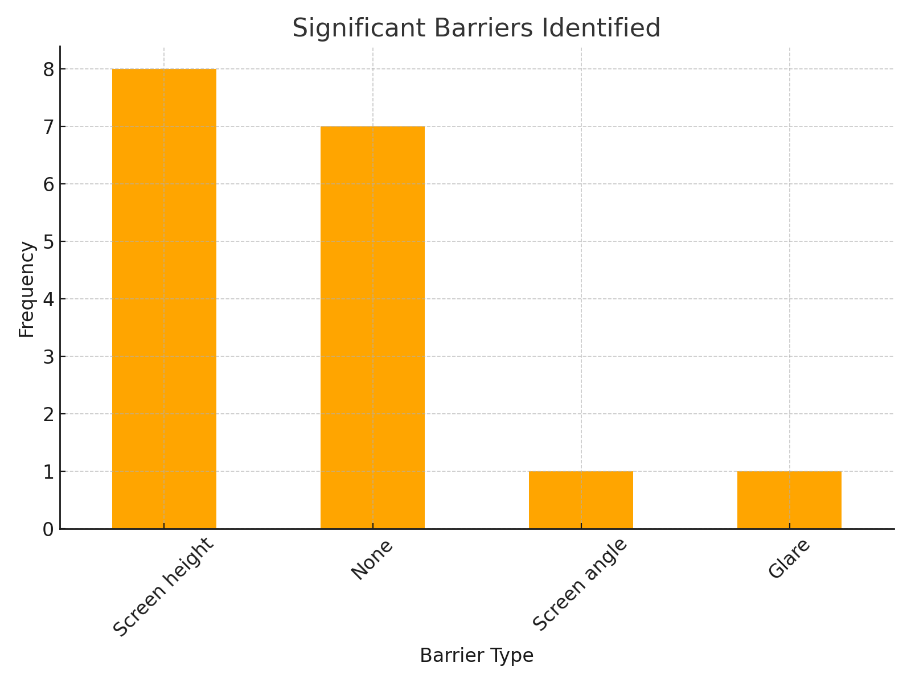
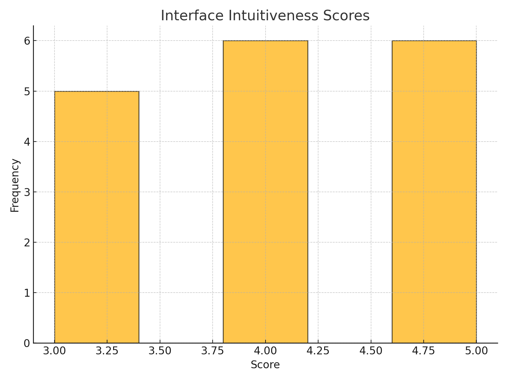
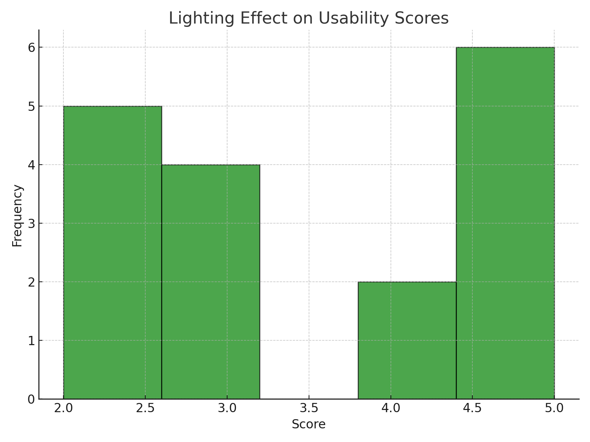
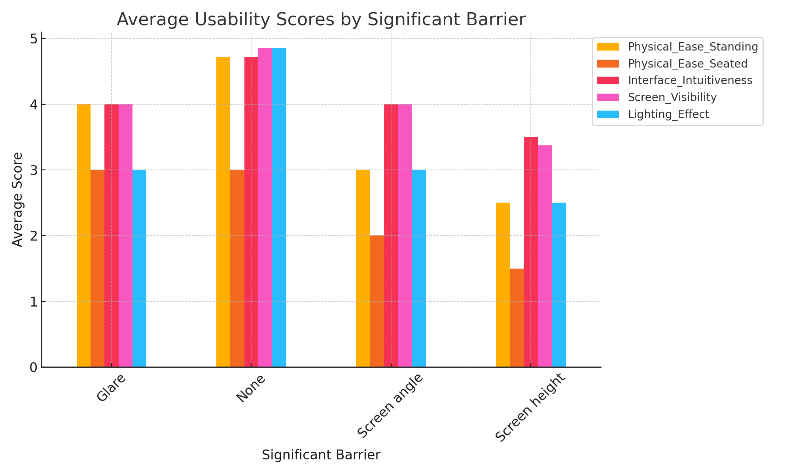

# Accessibility Design of McDonald's Kiosks

---

## Introduction

### Background
Public self-service kiosks are becoming integral to modern services, especially in quick-service restaurants like McDonald's. However, accessibility challenges hinder their inclusivity.

### Objectives
1. Identify design flaws in McDonald's kiosks that create accessibility barriers.
2. Propose actionable recommendations for improving their usability.
3. Evaluate the current interface and physical design using empirical methods.

---

## Methodology

### Approach
- No direct user testing to avoid ethical concerns.
- Observational analysis with physical measurements.
- Survey data collection from college and workplace participants.

### Data Collected
1. Physical measurements: screen height, angle, and reachability.
2. Interface usability: intuitiveness, recovery options, and visibility.
3. Environmental factors: glare, lighting, and space maneuverability.

---

## Results

### Age Group Distribution

- Majority of respondents are 18–29 years old, aligning with the college demographic.
- Representation from older age groups (30–49 and 65+) ensures the inclusion of diverse accessibility needs.

### Gender Distribution

- Nearly balanced gender participation enhances representativeness.
- Slight female majority could influence reported accessibility challenges.

### Assistive Device Usage

- Most respondents do not use assistive devices.
- The minority who do reveal critical barriers like screen height and glare.

### Significant Barriers Identified

- "Screen height" is the most common issue, followed by "screen angle."
- Highlights the necessity for adjustable and ergonomically optimized kiosks.

### Interface Intuitiveness Scores

- Scores cluster around 4 and 5, reflecting a generally intuitive interface.
- Lower scores suggest room for improvement in error recovery and navigation.

### Lighting Effect Scores

- Favorable scores overall, but glare issues persist in some environments.
- Matte screens and strategic placement could address these problems.

### Average Usability Scores by Barrier

- "Screen height" scores lowest for physical ease, reinforcing its role as a significant barrier.
- Intuitiveness and lighting scores are relatively unaffected by barriers.

---

## Discussion

### Insights
- Physical design (height, angle) directly impacts usability for assistive device users.
- Interface design is generally strong but needs refinement for specific edge cases.
- Environmental factors like lighting and space are secondary concerns but still important.

### Recommendations
1. **Adjustable Screen Height**: Implement adjustable mounts to cater to diverse users.
2. **Matte Screen Protection**: Reduce glare and enhance visibility in various lighting conditions.
3. **UI Improvements**: Simplify error recovery options and navigation.
4. **Environment Optimization**: Strategically position kiosks to reduce glare and improve space maneuverability.

---

## Conclusion

### Summary
- Addressing design flaws will make McDonald's kiosks more inclusive.
- Recommendations focus on universal design principles to meet diverse user needs.

### Future Work
1. Extend evaluation to other kiosk systems and environments.
2. Collaborate with accessibility experts for design validation.
3. Test proposed improvements in real-world settings.

---

## References
- ADA Standards for Accessible Design.
- Empirical survey data collected from participants.
- Observational studies on physical and interface design elements.

