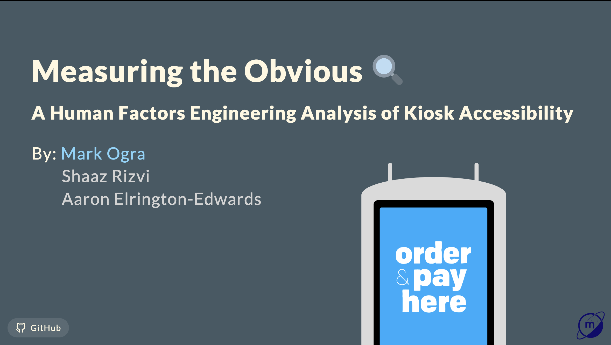

# IE323 - Human Factors Engineering Analysis

## Kiosk Accessibility Presentation
📊 [View the Presentation](https://markuryy.github.io/IE323)

<a href="https://markuryy.github.io/IE323" target="_blank" rel="noopener noreferrer"></a>

A comprehensive analysis of kiosk accessibility in public spaces, examining physical design, cognitive load, and user interaction patterns through the lens of Human Factors Engineering principles.

### Key Topics
- Fitts' Law & Target Acquisition Analysis
- Cognitive Load Theory Application
- Norman's Design Principles
- Accessibility Standards Compliance
- Cost-Benefit Analysis
- Methodological Critique


## Technical Stack

### Presentation
- **Framework**: [Marp](https://marp.app/) (Markdown Presentation Ecosystem)
- **Styling**: Custom CSS with grid layouts
- **Math Rendering**: MathJax
- **Theme**: Gaia (Inverted)

### Deployment
- **Platform**: GitHub Pages
- **CI/CD**: GitHub Actions
  - Workflow: `.github/workflows/marp-to-pages.yml`
  - Build Process: Node.js + Marp CLI
  - Automatic deployment on push to main branch

## Development

> 💡 **Tip**: The [Marp for VS Code](https://marketplace.visualstudio.com/items?itemName=marp-team.marp-vscode) extension is recommended for the best development experience. Note that some formatting might vary slightly between the extension preview and final output.

### Prerequisites
- [Bun](https://bun.sh/) (recommended) or Node.js
- If using Node.js: Marp CLI (`npm install -g @marp-team/marp-cli`)

### Local Development
```bash
# Using Bun
cd kiosk-presentation
bun dev

# OR using Node.js/npm
marp presentation.md -p
marp presentation.md -o dist/index.html
```

### GitHub Actions Workflow
The presentation is automatically built and deployed using GitHub Actions:
1. Installs Node.js and Marp CLI
2. Builds presentation from markdown to HTML
3. Deploys to GitHub Pages
4. Available at [https://markuryy.github.io/IE323](https://markuryy.github.io/IE323)

## License

Until the completion of the Fall 2024 semester and submission of final grades (no later than January 1st, 2025), these materials are restricted to use within the IE323 course at SUNY University at Buffalo. All analysis and materials are submitted under a limited license to the Department of Industrial and Systems Engineering (ISE) at SUNY University at Buffalo.

After final grade submission for Fall 2024 semester (or January 1st, 2025, whichever comes first), this project will enter the public domain under the [Unlicense](https://unlicense.org/). See the [LICENSE](LICENSE) file for details.

## Credits

### Technical Implementation
- **Research & Analysis**: [Mark Ogra](https://markury.dev)
- **Data Collection**: Original measurements and survey design
- **Visualization**: All graphics and data visualization
- **Documentation**: Technical writing and presentation
- **Development**: Repository setup and deployment

*This project uses the [Marp](https://marp.app/) presentation framework with custom styling and GitHub Pages deployment.*