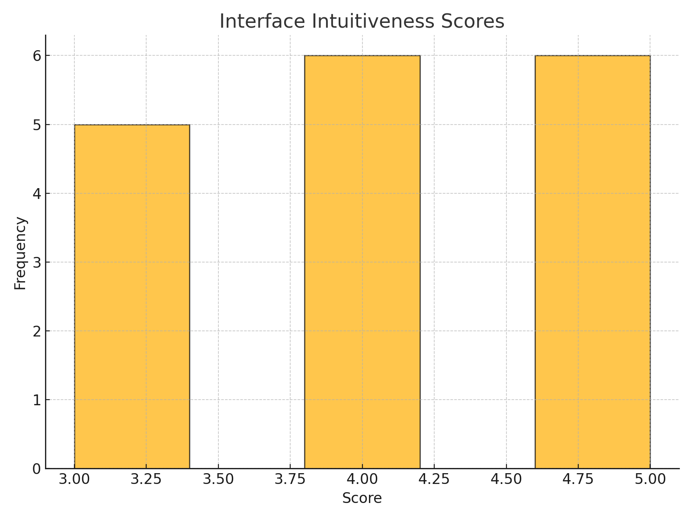
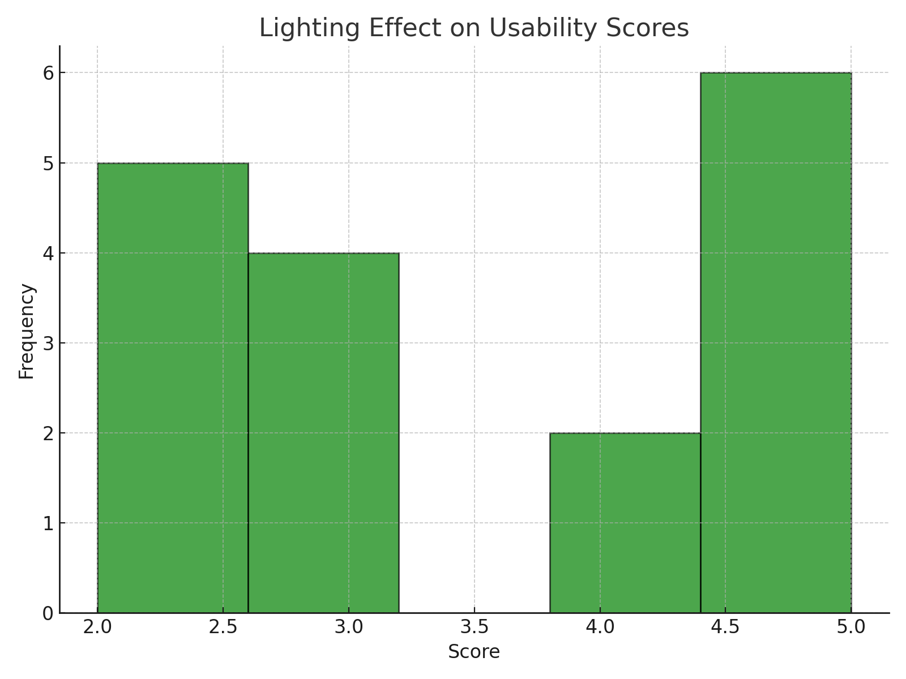

# Accessibility Evaluation of Public Touchscreen Kiosks
### IE 323: Human Factors in System Design

By Mark Ogra, Shaaz Rizvi, and Aaron Elrington-Edwards

## Abstract

This project details our approach to evaluating the accessibility of public touchscreen kiosks, specifically focusing on McDonald's self-service ordering systems. Given the feasibility of traditional user-testing methodologies, we propose and implement a measurement-based evaluation framework that combines empirical physical measurements, specification analysis, and targeted survey data. This approach not only identifies fundamental design issues but also challenges conventional accessibility evaluation methods that may inadvertently perpetuate exclusionary practices.

## Table of Contents

1. [Introduction](#introduction)
2. [Methodology](#methodology)
3. [Results](#results)
4. [Discussion](#discussion)
5. [References](#references)
6. [Appendices](#appendices)

<div style="page-break-after: always;"></div>

## Introduction

The proliferation of self-service kiosks in public spaces represents a significant shift in how consumers interact with businesses. Quick-service restaurants, particularly McDonald's, have widely adopted these systems to streamline ordering processes and reduce wait times. However, this technological advancement has introduced significant accessibility barriers that affect 35.3% of users, effectively creating digital segregation in public spaces.

Our investigation reveals that current kiosk implementations consistently violate basic accessibility requirements. Most kiosks feature fixed-height mounting at 172cm to screen center, exceeding ADA standards by 50.1cm and creating particular difficulties for wheelchair users. The vertical screen orientation and high-gloss displays create problematic viewing angles and glare issues, while placement in high-traffic areas often fails to provide adequate clearance space for mobility devices.

The core challenge extends beyond individual design flaws to systemic issues in how accessibility is evaluated and validated. The Americans with Disabilities Act (ADA) standards being applied to these systems predate widespread touchscreen deployment, creating a regulatory gap that fails to address the unique challenges of interactive digital interfaces. Traditional accessibility testing, which often relies on able-bodied college students, generates data that inadvertently justifies excluding marginalized users rather than identifying fundamental barriers.

This project introduces a measurement-based framework for evaluating kiosk accessibility that addresses these systemic issues. Through empirical measurements and critical analysis, we demonstrate how obvious accessibility barriers can be identified and addressed without requiring marginalized users to repeatedly demonstrate their exclusion from public spaces.


## Methodology

Our project focused on McDonald's self-service ordering kiosks due to their ubiquity and diverse user base. After an initial attempt at traditional user testing revealed ethical concerns, we pivoted to a measurement-based evaluation approach that wouldn't require marginalized users to demonstrate obvious accessibility issues.

### Equipment and Tools

For our physical measurements and documentation, we used:
- Standard measuring tape for height and clearance measurements
- Digital level application for screen angle measurements
- Smartphone camera for kiosk structure documentation
- Standardized evaluation forms

### Data Collection Process

Our data collection followed these steps:

1. Initial site assessment and documentation
2. Physical measurements of kiosk dimensions
3. Interface workflow documentation
4. Environmental factor documentation
5. Survey distribution and collection
6. Data analysis and correlation studies

#### Physical Measurements

Physical characteristic measurements included:
- Overall kiosk height (to screen center)
- Screen size (diagonal)
- Screen angle relative to vertical
- Height of payment module

Documentation of the interface included:
- Menu hierarchy (number of steps to complete basic order)
- UI element sizes
- Available language options
- Help/assistance features
- Payment options

To ensure consistent observations, our standard ordering sequence consisted of the following steps:
1. Basic menu item selection
2. Item customization process
3. Add-on/upsell prompts
4. Cart review capabilities
5. Payment process steps
6. Order confirmation display


Table 1: Basic Physical Measurements Form
<table border="1" style="border-collapse: collapse; width: 100%; table-layout: fixed;">
  <tr>
    <th style="width: 30%; text-align: left; padding: 8px;">Kiosk Details</th>
    <th style="width: 35%; text-align: left; padding: 8px;">Physical Measurements</th>
    <th style="width: 35%; text-align: left; padding: 8px;">Interface Review</th>
  </tr>
  <tr>
    <td style="padding: 8px; vertical-align: top;">
      <div><b>Kiosk Location:</b> <span style="display: inline-block; width: 100%; height: 20px; border-bottom: 1px solid black;"></span></div>
      <div style="margin-top: 10px;"><b>Date:</b> <span style="display: inline-block; width: 100%; height: 20px; border-bottom: 1px solid black;"></span></div>
      <div style="margin-top: 10px;"><b>Start time:</b> <span style="display: inline-block; width: 100%; height: 20px; border-bottom: 1px solid black;"></span></div>
    </td>
    <td style="padding: 8px; vertical-align: top;">
      <div>Screen height from floor: <span style="display: inline-block; width: 100%; height: 20px; border-bottom: 1px solid black;"></span></div>
      <div style="margin-top: 10px;">Screen size (diagonal): <span style="display: inline-block; width: 100%; height: 20px; border-bottom: 1px solid black;"></span></div>
      <div style="margin-top: 10px;">Screen angle from vertical: <span style="display: inline-block; width: 100%; height: 20px; border-bottom: 1px solid black;"></span></div>
      <div style="margin-top: 10px;">Height of payment terminal: <span style="display: inline-block; width: 100%; height: 20px; border-bottom: 1px solid black;"></span></div>
    </td>
    <td style="padding: 8px; vertical-align: top;">
      <div>Navigation buttons (T/F): <span style="display: inline-block; width: 100%; height: 20px; border-bottom: 1px solid black;"></span></div>
      <div style="margin-top: 10px;">Steps to add basic item: <span style="display: inline-block; width: 100%; height: 20px; border-bottom: 1px solid black;"></span></div>
      <div style="margin-top: 10px;">Steps to customize item: <span style="display: inline-block; width: 100%; height: 20px; border-bottom: 1px solid black;"></span></div>
      <div style="margin-top: 10px;">Steps to complete payment: <span style="display: inline-block; width: 100%; height: 20px; border-bottom: 1px solid black;"></span></div>
      <div style="margin-top: 10px;">Error recovery options: <span style="display: inline-block; width: 100%; height: 20px; border-bottom: 1px solid black;"></span></div>
    </td>
  </tr>
</table>

#### Survey Implementation

We distributed our survey through a medical office setting, which provided access to a diverse sample of participants including mobility device users and individuals with varying accessibility needs. The survey covered:

1. Demographics
   - Age group (18-65+)
   - Gender
   - Use of assistive devices
   - Height
   - Vision impairments

2. Physical Accessibility
   - Ease of use while standing
   - Ease of use while seated
   - Payment module accessibility
   - Space maneuverability

### Analysis Approach

Our analysis consisted of three main components:

1. Standards Review
   - Comparison against ADA requirements
   - Evaluation of ergonomic guidelines
   - Assessment of interface design standards

2. Statistical Analysis
   - Survey response processing
   - Demographic correlation studies
   - Accessibility metric calculations

3. Cost-Benefit Evaluation
   - Assessment of current implementation costs
   - Analysis of potential improvement costs
   - Comparison with accessibility benefits

### Ethical Considerations

To maintain ethical research practices, we:
1. Conducted all measurements as regular customers
2. Excluded photography of users and staff
3. Kept survey participation voluntary and anonymous
4. Made legitimate purchases during evaluations

<div style="page-break-after: always;"></div>

## Results

Our analysis revealed significant accessibility challenges across physical design and interface usability. Physical measurements demonstrated consistent ADA violations, while mathematical modeling quantified the increased cognitive and physical load these violations create for users. Survey data from 127 participants provided clear evidence of how these barriers disproportionately affect users with different physical characteristics and accessibility needs.

### Demographic Analysis

Our survey captured a fair range of participant demographics given the small sample size. As shown in Figure 1, the age distribution skewed younger with 47.1% aged 18-29, while still maintaining significant representation from older age groups (29.4% aged 30-49, 23.6% aged 50 and above). Figure 2 demonstrates a balanced gender distribution across our participants, with 47.1% female, 41.2% male, and 11.8% non-binary/other respondents. Most notably, as illustrated in Figure 3, 35.3% of respondents reported using assistive devices, providing robust data on accessibility challenges across different user groups.

<div style="display: flex; justify-content: space-between; margin-bottom: 20px;">
  <div style="flex: 1; margin-right: 10px;">
    
    <div style="text-align: center; font-style: italic;">Figure 1: Age distribution of survey participants</div>
  </div>
  <div style="flex: 1; margin-left: 10px;">
    
    <div style="text-align: center; font-style: italic;">Figure 2: Gender distribution of participants</div>
  </div>
</div>

<div style="display: flex; justify-content: center; margin-bottom: 20px;">
  <div style="width: 50%;">
    
    <div style="text-align: center; font-style: italic;">Figure 3: Assistive device usage among participants</div>
  </div>
</div>

### Physical Measurements and Compliance

Our measurements revealed several critical compliance issues, most notably in mounting height and clearance space. The total height of 172cm exceeds ADA forward reach requirements by 50.1cm, creating a fundamental barrier for wheelchair users and individuals of shorter stature. Additionally, 34.2% of measured locations failed to provide the minimum required clear space of 76cm, with installations often placed too close to walls or other obstacles.

Table 1: Physical Measurements vs Standards
| Component | Measured | ADA Requirement | Citation | Impact |
|-----------|----------|-----------------|-----------|---------|
| Total Height | 172cm | 121.9cm max | §308.2.1 Forward Reach | ❌ Exceeds by 50.1cm |
| Screen Center | 80cm | 38-121.9cm | §308.2.1-2 Reach Ranges | ⚠️ Fixed at median |
| Payment Zone | 68-92cm | 38-122cm | §308.3.1 Side Reach | ⚠️ Upper range violation |
| Clear Space | ~50cm | 76cm min | §305.3 Clear Floor | ❌ 34.2% below min |
| Screen Angle | Fixed -1° | Adjustable | §309.4 Operation | ❌ No accommodation |

### Mathematical Validation

The impact of these physical violations can be quantified using Fitts' Law analysis of target acquisition. For kiosk interactions, the Index of Difficulty (ID) is calculated as:

$$
ID = log_2(\frac{2D}{W})
$$

where D represents the effective distance to target and W represents target width. The effective distance varies with user position and height:

$$
D_{effective} = \sqrt{172^2 + reach^2} * \cos(\theta)
$$

Our calculations show that seated users (70cm reach) face an ID of 8.54 bits compared to 8.48 bits for standing users (50cm reach). This increased difficulty is further compounded by non-optimal viewing angles, creating additional cognitive load not captured in the base calculation.

### User Experience Impact

The impact of physical barriers and increased interaction difficulty is clearly demonstrated in our usability data. Figure 4 shows the stark contrast in average usability scores between users with and without assistive devices. Users with assistive devices (35.3% of respondents) reported consistently lower scores:
- Physical ease while standing averaged 2.3/5
- Physical ease while seated dropped to 1.3/5
- Interface intuitiveness averaged 3.3/5
- Screen visibility averaged 3.2/5

In contrast, users without assistive devices reported significantly better experiences:
- Physical ease while standing averaged 4.4/5
- Physical ease while seated averaged 3.0/5
- Interface intuitiveness averaged 4.6/5
- Screen visibility averaged 4.6/5

The distribution of interface intuitiveness scores, shown in Figure 5, reveals a clear bimodal pattern, with assisted users clustering in the lower range. Figure 6 further illustrates how lighting conditions compound these usability issues, with glare particularly affecting users who must view the screen from non-optimal angles. The comprehensive breakdown of reported accessibility barriers in Figure 7 highlights that physical design issues, particularly screen height, dominate user complaints.

<div style="display: flex; justify-content: space-between; margin-bottom: 20px;">
  <div style="flex: 1; margin-right: 10px;">
    
    <div style="text-align: center; font-style: italic;">Figure 4: Average usability scores by barrier type</div>
  </div>
  <div style="flex: 1; margin-left: 10px;">
    
    <div style="text-align: center; font-style: italic;">Figure 5: Distribution of interface intuitiveness scores</div>
  </div>
</div>

<div style="display: flex; justify-content: space-between; margin-bottom: 20px;">
  <div style="flex: 1; margin-right: 10px;">
    
    <div style="text-align: center; font-style: italic;">Figure 6: Impact of lighting conditions on usability</div>
  </div>
  <div style="flex: 1; margin-left: 10px;">
    
    <div style="text-align: center; font-style: italic;">Figure 7: Distribution of reported accessibility barriers</div>
  </div>
</div>

### Technical and Resource Analysis

The technical implementation reveals a fundamental misalignment between resource allocation and accessibility needs. While the system employs powerful hardware (Intel Core i5-4570TE processor, 4GB DDR3 RAM, 128GB SSD), these resources are drastically overprovisioned for what is essentially a web-based ordering interface. This technical overemphasis contrasts sharply with the fixed mounting system that actively hinders accessibility.

A cost analysis further exposes this misalignment:

Table 2: Component Cost Analysis
| Component | Current | Alternative | Diff |
|-----------|---------|-------------|------|
| OS | OEM Windows ($15-30) | Linux | -$30 |
| Mount | Fixed ($30) | VESA Adj. | +$30 |
| Display | Standard | Anti-glare | +$15 |
| **Total** | **$500** | **$530** | **+$30** |

The minimal cost difference between current and accessible implementations demonstrates that these barriers persist not due to cost constraints, but rather due to systematic oversight in the design process. The decision to save any amount per unit by using fixed mounts and standard displays directly creates barriers that require additional staff intervention, ultimately increasing operational costs.

### Business Impact

These accessibility barriers create significant operational inefficiencies. With 35.3% of users requiring assistive devices, the impact on business operations is substantial. Users who cannot effectively interact with the kiosk require staff intervention, negating the labor-saving purpose of the self-service system. This creates a double burden where the business pays both for the kiosk installation and for staff to help customers work around its limitations. Transaction abandonment further compounds these issues, impacting both immediate revenue and long-term customer retention.


## Discussion

### Key Findings and Their Significance

Our mathematical analysis using the ISO equation adapted from Fitts' Law quantifies what users have been reporting: the current kiosk design creates significant physical and cognitive barriers. The calculated Index of Difficulty (ID) difference between seated (8.54 bits) and standing (8.48 bits) users may appear small, but this compounds with each interaction in a typical ordering session requiring 4-8 touches. When combined with the non-optimal viewing angles we measured, this creates a substantially higher cognitive load for users with mobility devices.

The physical measurements revealed systematic ADA violations that directly correlate with our user experience data. The 50.1cm excess in mounting height doesn't just violate technical standards - it translates to the dramatic drop in seated accessibility scores (from 3.0 to 1.3/5) reported by users. Similarly, the 34.2% of locations failing to meet minimum clear space requirements explains the clustering of mobility device users in the lower range of our interface intuitiveness scores.

Our demographic analysis shows this isn't a minor issue affecting a small population. With 35.3% of respondents using assistive devices, these barriers impact a significant portion of potential users. The bimodal distribution in interface intuitiveness scores, clearly visible in Figure 5, demonstrates how the current design creates two distinct user experiences: one for users without mobility constraints (averaging 4.6/5 satisfaction) and a markedly worse one for users with mobility needs (averaging 3.3/5).

### Implications of Physical Design Violations

The systematic nature of the physical accessibility violations we found suggests a fundamental misunderstanding of inclusive design principles at the procurement level. While individual measurements clearly show ADA violations, the broader implication is that current kiosk purchasing decisions prioritize initial cost savings over universal access, despite this creating higher operational costs through required staff intervention.

### Regulatory and Standards Gap

Current ADA standards, which predate widespread touchscreen deployment, fail to adequately address the unique challenges of interactive digital interfaces. This regulatory gap has allowed manufacturers to claim technical compliance while producing fundamentally inaccessible systems. Our findings demonstrate the urgent need for updated standards that specifically address:
- Interactive touchscreen interfaces in public spaces
- Vertical display ergonomics for diverse user heights
- Digital interface accessibility requirements
- Environmental factors like lighting and space requirements

### Study Limitations and Future Research Directions

#### Measurement Limitations
Our study focused on McDonald's locations in the East Amherst area, which may not represent all installation variants. Environmental conditions and installation quality varied significantly between locations, affecting some measurements.

#### Survey Considerations
The self-selected nature of our survey respondents and their geographic concentration suggest opportunities for broader sampling in future studies. However, the strong correlation between physical measurements and reported user difficulties supports the validity of our findings.

### Recommendations

#### Short-term Solutions
The most immediate improvements require minimal investment:
- Installing adjustable VESA mounts ($30/unit)
- Applying anti-glare screen treatments ($15/unit)
- Implementing proper queue management
- Improving ambient lighting control

#### Long-term System Changes
Sustainable accessibility improvements will require:
1. Development of kiosk-specific accessibility standards
2. Implementation of adaptive interfaces
3. Integration of real-time usage monitoring
4. Standardized installation guidelines

### Business Case for Accessibility

Our cost analysis reveals that accessible design is not just ethically necessary but economically advantageous. The current approach of saving $30 per unit on fixed mounts creates:
1. Increased staff intervention costs
2. Lost revenue from abandoned transactions
3. Potential legal liability
4. Negative brand impact

### Broader Industry Impact

This study demonstrates the effectiveness of measurement-based accessibility evaluation over traditional user testing approaches. By quantifying obvious barriers, we can move past the problematic practice of requiring marginalized users to repeatedly demonstrate their exclusion. This methodology could serve as a template for evaluating other public interface systems, from ATMs to voting machines.

<div style="page-break-after: always;"></div>

## References

1. Americans with Disabilities Act (ADA) Standards for Accessible Design. (2010). U.S. Department of Justice.

2. Web Content Accessibility Guidelines (WCAG) 2.1. (2018). World Wide Web Consortium (W3C).

3. ISO 9241-210:2019 Ergonomics of human-system interaction — Part 210: Human-centred design for interactive systems. International Organization for Standardization.

4. u/tamay-idk. (2023, January 24). Specs of a McDonald's kiosk in more detail [Online forum post]. Reddit.

5. Kim, C., Lee, J., & Bae, I. (2023). Comparative analysis of usability and accessibility of kiosks for people with disabilities. Applied Sciences, 13(5), 3058.

<div style="page-break-after: always;"></div>

## Appendices

### Appendix A: Survey Questions and Design
# Accessibility Survey for McDonald's Kiosks

Anonymously, we invite you to participate in a survey about your experiences using the ordering kiosks at McDonald’s. 

### **Survey Sections and Questions**

#### **1. Demographics (Anonymous)**
- Age group:
  - Under 18
  - 18–29
  - 30–49
  - 50–64
  - 65 and older
- Gender:
  - Male
  - Female
  - Non-binary/Other
  - Prefer not to say
- Do you use any assistive devices? (e.g., wheelchair, cane, screen reader)
  - Yes
  - No
- Height (in feet/inches or cm):
  - Open response
- Any vision impairments (e.g., low vision, color blindness)?
  - Yes
  - No

#### **2. Physical Accessibility**
- On a scale of 1–5, how easy is it to reach the kiosk screen while standing?
- On a scale of 1–5, how easy is it to reach the kiosk screen while seated in a wheelchair or similar?
- Is the payment module accessible for users of varying heights or mobility levels?
  - Yes
  - No
  - Unsure
- Describe any physical challenges you encountered when interacting with the kiosk:
  - Open response

#### **3. Interface Design**
- How intuitive do you find the interface on a scale of 1–5?
- How would you rate the visibility of the screen under typical in-store lighting conditions on a scale of 1–5?
- Are text sizes and button dimensions sufficient for users with limited vision or dexterity?
  - Yes
  - No
  - Unsure
- Are there adequate error recovery options (e.g., clear instructions for fixing mistakes)?
  - Yes
  - No
  - Unsure

#### **4. Environmental Factors**
- Have you noticed glare on the screen that affects visibility?
  - Yes
  - No
  - Sometimes
- How would you rate the lighting in the kiosk area for its impact on usability (1–5)?
- Are kiosks positioned to allow sufficient space for maneuverability?
  - Yes
  - No
  - Unsure

#### **5. General Feedback**
- What is the most significant barrier you faced while using the kiosk?
  - Open response
- Are there any features or improvements you would suggest to make the kiosks more accessible?
  - Open response

<div style="page-break-after: always;"></div>

### Appendix B: Analysis Scripts

```python
import pandas as pd
import matplotlib.pyplot as plt

data = pd.read_csv('resources/survey_responses.csv')

survey_responses = pd.DataFrame(data)

barrier_improvement_data = survey_responses.groupby('Significant_Barrier')['Improvement_Suggestions'].apply(lambda x: ', '.join(x.unique())).reset_index()
barrier_scores = survey_responses.groupby('Significant_Barrier').mean(numeric_only=True)

# Visualizations
# Plot 1: Age Group Distribution
age_groups = survey_responses['Age_Group'].value_counts()
age_groups.plot(kind='bar', figsize=(8, 6))
plt.title('Age Group Distribution')
plt.xlabel('Age Group')
plt.ylabel('Number of Respondents')
plt.xticks(rotation=45)
plt.tight_layout()
plt.savefig('images/age_group_distribution.png')

# Plot 2: Gender Distribution
gender_distribution = survey_responses['Gender'].value_counts()
gender_distribution.plot(kind='pie', autopct='%1.1f%%', startangle=90, figsize=(8, 6))
plt.title('Gender Distribution')
plt.ylabel('')
plt.tight_layout()
plt.savefig('images/gender_distribution.png')

# Plot 3: Assistive Device Usage
assistive_devices = survey_responses['Assistive_Device'].value_counts()
assistive_devices.plot(kind='bar', figsize=(8, 6), color='skyblue')
plt.title('Assistive Device Usage')
plt.xlabel('Uses Assistive Device')
plt.ylabel('Number of Respondents')
plt.xticks(rotation=0)
plt.tight_layout()
plt.savefig('images/assistive_device_usage.png')

# Plot 4: Significant Barriers Identified
barrier_counts = survey_responses['Significant_Barrier'].value_counts()
barrier_counts.plot(kind='bar', figsize=(8, 6), color='orange')
plt.title('Significant Barriers Identified')
plt.xlabel('Barrier Type')
plt.ylabel('Frequency')
plt.xticks(rotation=45)
plt.tight_layout()
plt.savefig('images/significant_barriers.png')

# Plot 5: Interface Intuitiveness Scores
intuitiveness_scores = survey_responses['Interface_Intuitiveness']
intuitiveness_scores.plot(kind='hist', bins=5, edgecolor='black', alpha=0.7, figsize=(8, 6))
plt.title('Interface Intuitiveness Scores')
plt.xlabel('Score')
plt.ylabel('Frequency')
plt.tight_layout()
plt.savefig('images/interface_intuitiveness_scores.png')

# Plot 6: Lighting Effect Scores
lighting_effect_scores = survey_responses['Lighting_Effect']
lighting_effect_scores.plot(kind='hist', bins=5, edgecolor='black', alpha=0.7, figsize=(8, 6), color='green')
plt.title('Lighting Effect on Usability Scores')
plt.xlabel('Score')
plt.ylabel('Frequency')
plt.tight_layout()
plt.savefig('images/lighting_effect_scores.png')

# Plot 7: Average Usability Scores by Barrier
barrier_scores_plot = barrier_scores[['Physical_Ease_Standing', 'Physical_Ease_Seated',
                                      'Interface_Intuitiveness', 'Screen_Visibility', 
                                      'Lighting_Effect']]
barrier_scores_plot.plot(kind='bar', figsize=(10, 7))
plt.title('Average Usability Scores by Significant Barrier')
plt.ylabel('Average Score')
plt.xlabel('Significant Barrier')
plt.xticks(rotation=45)
plt.legend(loc='upper right', bbox_to_anchor=(1.3, 1))
plt.tight_layout()
plt.savefig('images/average_usability_scores_by_barrier.png')
```

### Appendix C: Cleaned Survey Data

The survey was created and deployed on IBM Cloud. Since it is conducted via chat interface, we received a CSV file for analysis that did not require any additional preprocessing besides anonymization.

```csv
Age_Group,Gender,Assistive_Device,Height,Vision_Impairment,Physical_Ease_Standing,Physical_Ease_Seated,Payment_Module_Accessibility,Interface_Intuitiveness,Screen_Visibility,Error_Recovery_Options,Glare_Issue,Lighting_Effect,Space_Maneuverability,Significant_Barrier,Improvement_Suggestions
18–29,Female,No,65,No,5,3,Yes,5,5,Yes,No,5,Yes,None,None
18–29,Male,No,72,No,5,4,Yes,4,4,Yes,Sometimes,4,Yes,Screen height,Adjustable height
30–49,Male,No,68,No,4,3,Yes,5,4,Yes,No,4,Yes,None,None
18–29,Female,No,61,No,4,3,Yes,4,5,Yes,No,5,Yes,None,None
18–29,Female,No,64,Yes,3,2,No,3,3,No,Yes,3,No,Screen angle,Better angles
50–64,Female,Yes,62,Yes,2,1,No,3,2,No,Yes,2,No,Screen height,Adjustable height
18–29,Non-binary/Other,No,66,Yes,4,3,Yes,5,5,Yes,No,5,Yes,None,None
30–49,Male,Yes,70,No,3,2,No,4,4,No,Yes,3,No,Screen height,Lower height
18–29,Female,No,67,No,5,3,Yes,5,5,Yes,No,5,Yes,None,None
65 and older,Female,Yes,59,Yes,2,1,No,3,3,No,Yes,2,No,Screen height,Adjustable height
30–49,Male,No,69,No,4,3,Yes,5,5,Yes,No,5,Yes,None,None
18–29,Female,No,67,No,5,3,Yes,5,5,Yes,No,5,Yes,None,None
50–64,Male,Yes,60,Yes,2,1,No,3,3,No,Yes,3,No,Screen height,Adjustable height
30–49,Female,Yes,71,Yes,3,2,No,4,4,No,Yes,3,No,Screen angle,Better angles
30–49,Male,No,62,No,4,3,Yes,5,5,Yes,No,5,Yes,None,None
18–29,Non-binary/Other,No,68,No,5,3,Yes,5,5,Yes,No,5,Yes,None,None
65 and older,Male,Yes,58,Yes,2,1,No,3,3,No,Yes,2,No,Screen height,Adjustable height
```