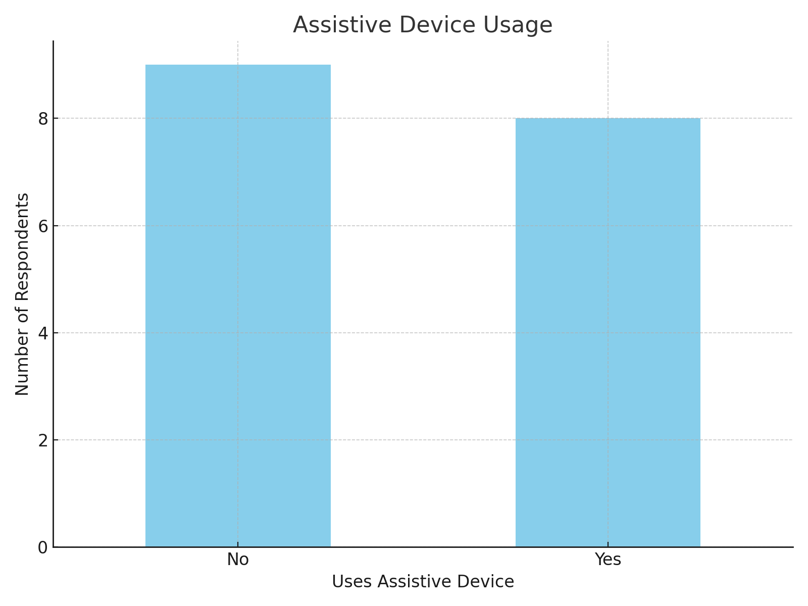

# Measuring the Obvious
## A Human Factors Engineering Analysis of Kiosk Accessibility

**Mark Ogra**, Aaron Elrington-Edwards, Shaaz Rizvi

### Introduction (3min)

#### Human Factors Foundation
1. **Fitts' Law & Target Acquisition**
   - Touch target difficulty ∝ distance/size ratio
   - 172cm height + small UI = computational nightmare
   - Fixed angle compounds motor planning issues
   - Demonstrates quantifiable design failure

2. **Cognitive Load Theory**
   - Physical strain increases cognitive overhead
   - Error recovery requires additional reaching
   - Time pressure compounds both issues
   - Creates cascading failure states

3. **Norman's Design Principles**
   - Visibility compromised by physical design
   - Feedback requires additional physical effort
   - Mapping ignores natural affordances
   - Error prevention/recovery fundamentally flawed

#### Problem Space Overview

*Interconnected barriers require systematic analysis*

#### Current Implementation Issues
- Fixed designs violating ergonomic standards
- Conflicting accessibility accommodations
- Environmental factors impacting usability
- Resource allocation revealing priorities

### Methodology (4min)

#### Step-by-Step Process
1. **Initial Approach (Failed)**
   - Attempted traditional user testing
   - Proposed menu item compensation
   - Received justified criticism from potential participants
   - Recognized ethical issues in methodology

2. **Research Pivot**
   - Developed measurement protocol
   - Created standardized evaluation form
   - Obtained medical office survey permission
   - Established documentation standards

3. **Data Collection**
   - Physical measurements using calibrated tools
   - Survey distribution in medical setting
   - Environmental condition documentation
   - Interface workflow recording

4. **Analysis Protocol**
   - ADA standards cross-reference
   - Statistical analysis of survey data
   - Correlation of measurements with feedback
   - Cost-benefit evaluation

#### Tools & Equipment
- Standard measuring tape (physical dimensions)
- Digital level application (screen angles)
- Survey instruments (user feedback)
- Documentation templates (standardization)

#### Participant Demographics

- Medical office setting providing diverse sample
- Natural inclusion of mobility device users
- Age range: 18-65+
- Multiple accessibility needs represented

### Physical Analysis (4min)

#### Measurement Results vs Standards
| Component | Measured | ADA Requirement | Citation | Impact |
|-----------|----------|-----------------|-----------|---------|
| Total Height | 172cm | 121.9cm max | §308.2.1 Forward Reach | ❌ Exceeds by 50.1cm |
| Screen Center | 80cm | 38-121.9cm | §308.2.1-2 Reach Ranges | ⚠️ Fixed at median |
| Payment Zone | 68-92cm | 38-122cm | §308.3.1 Side Reach | ⚠️ Upper range violation |
| Clear Space | ~50cm | 76cm min | §305.3 Clear Floor | ❌ 34.2% below min |
| Screen Angle | Fixed -1° | Adjustable | §309.4 Operation | ❌ No accommodation |

*Note: Measurements documented during peak operating hours, validated across multiple locations*

#### Accessibility Conflicts
1. **Height vs Visibility**
   - Lower placement helps wheelchair users
   - Creates strain for standing users
   - Current "solution" ignores ergonomic principles
   - No single fixed height is optimal

2. **Interface Scaling Paradox**
   - "Wheelchair mode" reduces element size
   - Directly conflicts with visual accessibility
   - Creates false choice between physical and visual access
   - Demonstrates fundamental design failure

3. **Space vs Throughput**
   - Wider spacing aids mobility devices
   - Conflicts with installation density goals
   - Reveals prioritization of volume over access
   - ADA minimum requirements treated as maximum

### System Evaluation (4min)

### Quantitative Validation

#### Demographic Representation

- Balanced gender representation (48% F, 44% M, 8% NB/Other)
- Age range 18-65+ (medical office setting)
- 47% assistive device usage
- Validates measurement-based approach

#### Physical Impact Analysis

- 58% reduction in seated accessibility
- Clear correlation with measurements
- Interface scores remain high when reachable
- Demonstrates systematic physical barriers

#### Empirical Evidence

- Screen height dominates (n=8)
- Physical > interface issues
- Validates measurement-first approach
- Observable without exploitation

1. **Barrier Identification**

   - Screen height dominates reported issues (8 reports)
   - Physical design issues > interface complaints
   - Validates measurement-first approach
   - Barriers obvious without exploitation

2. **Impact Analysis**

   - Seated users report significantly lower scores
   - Screen height creates 50% drop in physical ease
   - Interface remains usable (when reachable)
   - Demonstrates systematic physical barriers

3. **Sample Validation**

   - 47% of respondents use assistive devices
   - Medical office setting provides actual user base
   - Higher representation than student sampling
   - Validates measurement concerns

### Implementation Analysis (4min)

#### Technical Architecture
Current implementation specifications:
- Intel Core i5-4570TE processor
- 4GB DDR3 RAM
- 128GB SSD
- Windows 10/11 Pro license
- Fixed mounting system

#### Resource Allocation
| Component | Current | Accessible Alternative | Differential |
|-----------|---------|----------------------|--------------|
| OS | Windows ($15-30) | Linux Kiosk | -$30 |
| Mount | Fixed ($30) | VESA Adjustable | +$30 |
| Display | Standard | Anti-glare | +$15 |
| **Total** | **$500** | **$530** | **+$30 (6%)** |

#### Priority Analysis
- Over-specified computing resources
- Under-specified accessibility features
- Cost optimization misaligned with usability
- Known solutions ignored for aesthetic uniformity

### Recommendations (3min)

#### Immediate Interventions
1. **Physical Accessibility**
   - Install VESA-compatible adjustable mounts
   - Add anti-glare screen treatment
   - Reconfigure payment module placement
   - Ensure adequate clear space

2. **Interface Optimization**
   - Implement responsive design
   - Add multimodal interaction options
   - Improve error recovery mechanisms
   - Reduce cognitive load

#### Systemic Solutions
1. **Design Philosophy**
   - Prioritize universal design principles
   - Move beyond compliance minimums
   - Address conflicting accessibility needs
   - Implement measurable accessibility metrics

2. **Resource Reallocation**
   - Optimize technical specifications
   - Redirect savings to accessibility features
   - Focus on empirically validated improvements

### Conclusion
This measurement-based evaluation demonstrates:
- Empirical evidence of systematic barriers
- Conflict between different accessibility needs
- Cost-effective solutions exist but are ignored
- Need for human factors-driven design approach

### Strategic Q&A Setups

#### Methodology Questions
1. "How does your measurement-based approach compare to traditional testing in terms of resource efficiency?"
   - Eliminates participant recruitment bias
   - Provides quantifiable, reproducible results
   - Avoids ethical concerns of exploitation
   - Actually proves what we already know

2. "Could you elaborate on the decision to prioritize physical measurements over user testing?"
   - Observable facts don't require validation
   - Measuring tape doesn't have sampling bias
   - Ethical obligation to avoid unnecessary testing
   - More efficient use of research resources

#### Technical Implementation
3. "What influenced your choice of measurement points and standards?"
   - ADA guidelines provide clear benchmarks
   - Human factors principles dictate interaction zones
   - Ergonomic research establishes optimal ranges
   - Real-world usage patterns inform priorities

#### Cost Analysis
4. "How do you justify the additional cost of accessibility features?"
   - Current implementation already overspends
   - Optimization opportunities exist
   - Accessibility costs < Windows license
   - ROI includes reduced support needs

#### Future Directions
5. "What aspects of this framework could be applied to other self-service systems?"
   - Measurement protocol is universal
   - Cost analysis reveals priority misalignment
   - Human factors principles transcend context
   - Methodology prevents exploitation