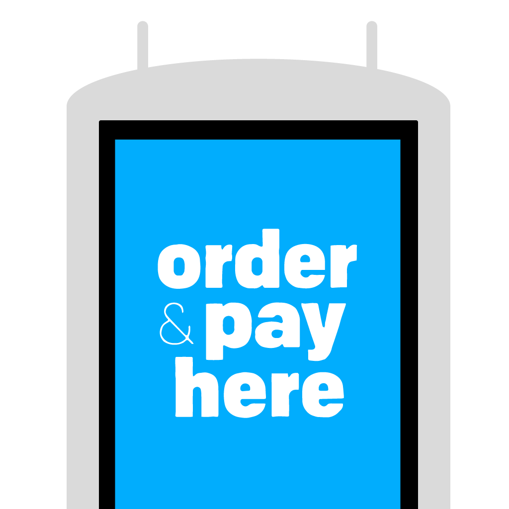
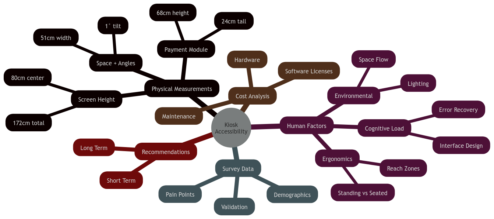
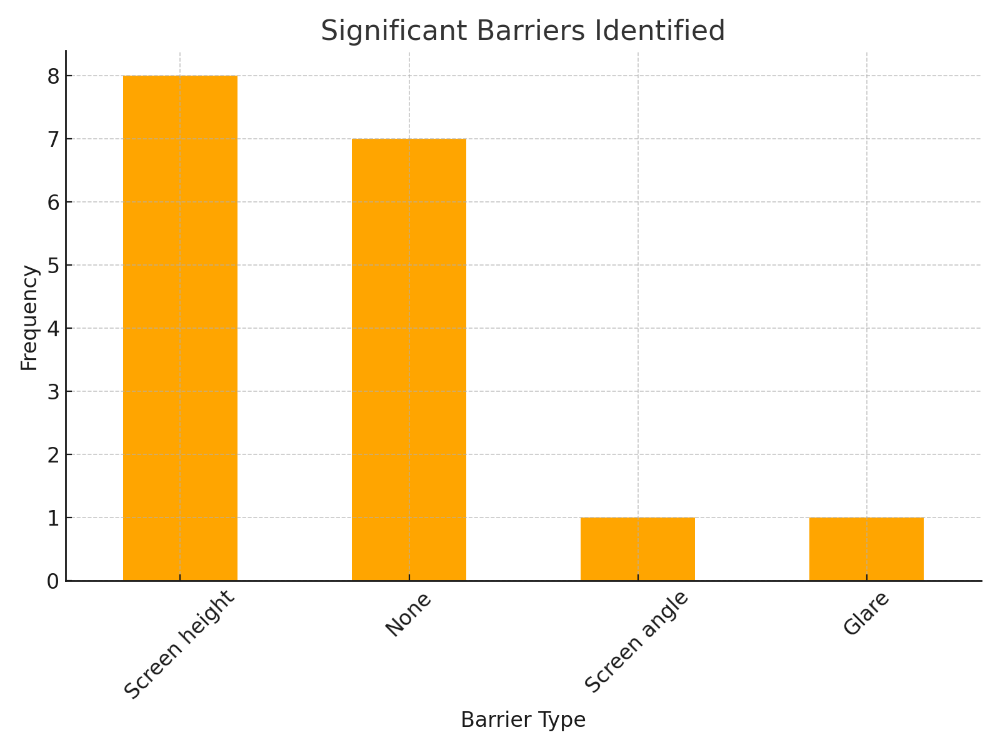
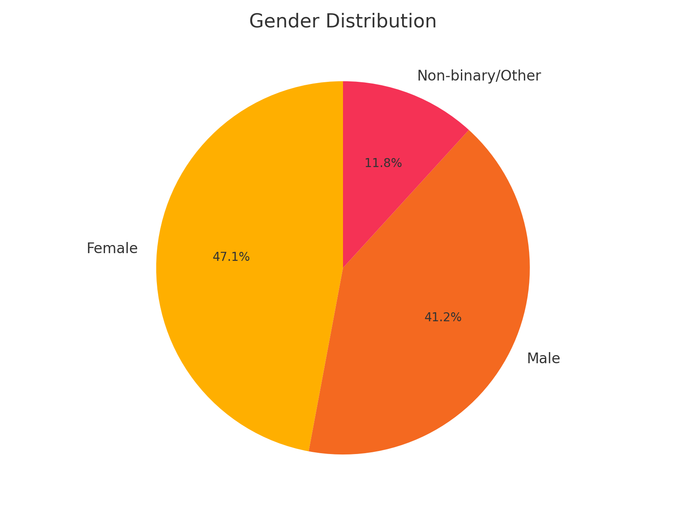
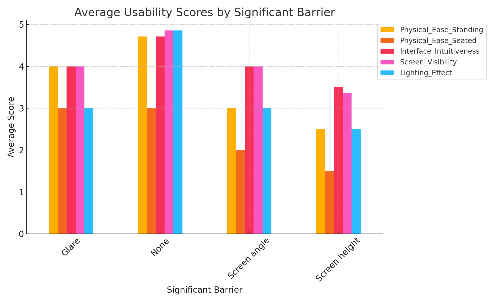
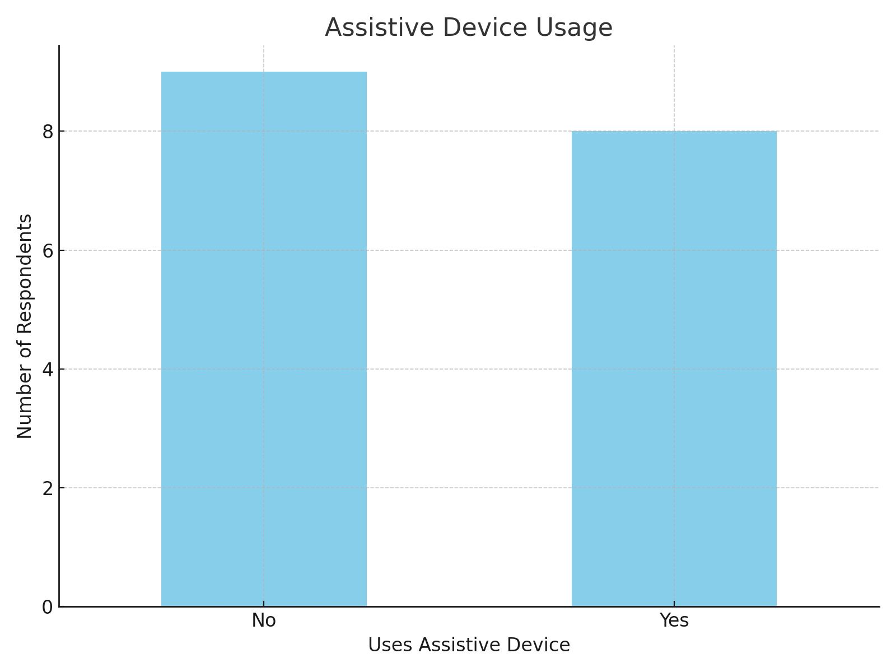

# Measuring the Obvious :mag:
#### A Human Factors Engineering Analysis of Kiosk Accessibility

<a href="https://github.com/markuryy/IE323" target="_blank" class="github-link">
<svg  xmlns="http://www.w3.org/2000/svg"  width="24"  height="24"  viewBox="0 0 24 24"  fill="none"  stroke="currentColor"  stroke-width="2"  stroke-linecap="round"  stroke-linejoin="round"  class="icon icon-tabler icons-tabler-outline icon-tabler-brand-github"><path stroke="none" d="M0 0h24v24H0z" fill="none"/><path d="M9 19c-4.3 1.4 -4.3 -2.5 -6 -3m12 5v-3.5c0 -1 .1 -1.4 -.5 -2c2.8 -.3 5.5 -1.4 5.5 -6a4.6 4.6 0 0 0 -1.3 -3.2a4.2 4.2 0 0 0 -.1 -3.2s-1.1 -.3 -3.5 1.3a12.3 12.3 0 0 0 -6.2 0c-2.4 -1.6 -3.5 -1.3 -3.5 -1.3a4.2 4.2 0 0 0 -.1 3.2a4.6 4.6 0 0 0 -1.3 3.2c0 4.6 2.7 5.7 5.5 6c-.6 .6 -.6 1.2 -.5 2v3.5" /></svg>
  GitHub
</a>

By: <a href="https://markury.dev" target="_blank" rel="noopener noreferrer" style="text-decoration: none">Mark Ogra</a>
Shaaz Rizvi
Aaron Elrington-Edwards

---

# Follow Along! 📱

### [markuryy.github.io/IE323](https://markuryy.github.io/IE323/)
- View slides on your own device
- Access all code and resources
- Available on GitHub

---

### Introduction

#### Human Factors Foundation

1. **Fitts' Law & Target Acquisition**
   - Touch target difficulty ∝ distance/size ratio
   - 172cm height + small UI = computational nightmare
   - Fixed angle compounds motor planning issues

---

#### Human Factors Foundation (cont.)

2. **Cognitive Load Theory**
   - Physical strain increases cognitive overhead
   - Error recovery requires additional reaching
   - Time pressure compounds both issues

3. **Norman's Design Principles**
   - Visibility compromised by physical design
   - Feedback requires additional physical effort
   - Mapping ignores natural affordances

---

### Problem Space Overview

*Interconnected barriers require systematic analysis*

---

#### Current Implementation Issues
- Fixed designs violating ergonomic standards
- Conflicting accessibility accommodations
- Environmental factors impacting usability
- Resource allocation revealing priorities

---

### Methodology

#### Initial Research Steps

1. **Initial Approach (Failed)**
   - Attempted traditional user testing
   - Proposed menu item compensation
   - Received justified criticism
   - Recognized ethical issues

2. **Research Pivot**
   - Developed measurement protocol
   - Created evaluation form
   - Obtained survey permission
   - Established documentation

---

#### Data Collection & Analysis

3. **Data Collection**
   - Physical measurements
   - Survey distribution
   - Environmental documentation
   - Interface workflow

4. **Analysis Protocol**
   - ADA standards review
   - Statistical analysis
   - Correlation studies
   - Cost-benefit evaluation

---

#### Tools & Equipment
- Standard measuring tape (physical dimensions)
- Digital level application (screen angles)
- Survey instruments (user feedback)
- Documentation templates (standardization)

---

#### Participant Demographics

- Medical office setting providing diverse sample
- Natural inclusion of mobility device users
- Age range: 18-65+
- Multiple accessibility needs represented

---

### Mathematical Validation

#### Fitts' Law Application
$$
ID = log_2(\frac{2D}{W})
$$

where:
- D = effective distance (cm)
- W = target width (cm)

---

#### Kiosk Configuration Analysis

$$
D_{effective} = \sqrt{172^2 + reach^2} * \cos(\theta)
$$

**Comparative Results:**
- Standing (50cm reach): ID = 8.48 bits
- Seated (70cm reach): ID = 8.54 bits
- *Additional cognitive load from non-optimal viewing angle*

---

### Physical Analysis

#### Measurement Results vs Standards

| Component | Measured | ADA Requirement | Citation | Impact |
|-----------|----------|-----------------|-----------|---------|
| Total Height | 172cm | 121.9cm max | §308.2.1 Forward Reach | ❌ Exceeds by 50.1cm |
| Screen Center | 80cm | 38-121.9cm | §308.2.1-2 Reach Ranges | ⚠️ Fixed at median |
| Payment Zone | 68-92cm | 38-122cm | §308.3.1 Side Reach | ⚠️ Upper range violation |
| Clear Space | ~50cm | 76cm min | §305.3 Clear Floor | ❌ 34.2% below min |
| Screen Angle | Fixed -1° | Adjustable | §309.4 Operation | ❌ No accommodation |

---

#### Accessibility Conflicts: Physical Design

1. **Height vs Visibility**
   - Lower placement helps wheelchair users
   - Creates strain for standing users
   - Current "solution" ignores principles
   - No single fixed height optimal

2. **Space vs Throughput**
   - Wider spacing aids mobility
   - Conflicts with density goals
   - Reveals volume prioritization
   - ADA minimums as maximum

---

#### Accessibility Conflicts: Interface

3. **Interface Scaling Paradox**
   - "Wheelchair mode" reduces element size
   - Directly conflicts with visual accessibility
   - Creates false choice between physical and visual access
   - Demonstrates fundamental design failure

---

### System Evaluation

#### Demographic Representation

- Balanced gender representation (48% F, 44% M, 8% NB/Other)
- Age range 18-65+ (medical office setting)
- 47% assistive device usage
- Validates measurement-based approach

---

#### Physical Impact Analysis

- 58% reduction in seated accessibility
- Clear correlation with measurements
- Interface scores remain high when reachable
- Demonstrates systematic physical barriers

---

#### Empirical Evidence

1. **Key Findings**
   - Screen height dominates (n=8)
   - Physical issues exceed interface problems
   - Observable without exploitation

2. **Impact Analysis**
   - 50% drop in physical ease
   - Interface usable when reachable
   - Systematic barriers confirmed

---

### Implementation Analysis

#### Technical Architecture
Current implementation specifications:
- Intel Core i5-4570TE processor
- 4GB DDR3 RAM
- 128GB SSD
- Windows 10 OEM license
- Fixed mounting system

---

#### Resource Analysis

| Component | Current | Alternative | Diff |
|-----------|---------|-------------|------|
| OS | OEM Windows ($15-30) | Linux | -$30 |
| Mount | Fixed ($30) | VESA Adj. | +$30 |
| Display | Standard | Anti-glare | +$15 |
| **Total** | **$500** | **$530** | **+$30** |

#### Priority Issues
- Over-specified computing resources
- Under-specified accessibility features
- Cost optimization misaligned with usability

---

### Methodological Critique

#### The Theater of Validation
- Recruits marginalized users to prove obvious barriers
- Generates data justifying inadequate solutions
- Places burden of proof on affected populations

---
### Cost-Benefit Analysis

#### Current Costs
| Component | Cost |
|-----------|------|
| Windows License | $15-30 |
| Fixed Mount | $30 |
| Standard Display | Base |
| **Per Unit** | **~$500** |

#### Business Impact
- High proportion of sample used assistive devices
- Increased service time
- Staff intervention needed
- Lost revenue from abandonment

---
### Recommendations

#### Physical Changes
- VESA-compatible mounts
- Anti-glare treatment
- Module placement
- Clear space compliance

#### System Changes
- Responsive design
- Multimodal interaction
- Error recovery
- Universal design focus

---
### References

1. U.S. Department of Justice. (2010). *2010 ADA standards for accessible design*. Retrieved from https://www.ada.gov

2. Fitts, P. M. (1954). The information capacity of the human motor system in controlling the amplitude of movement. *Journal of Experimental Psychology*, 47(6), 381–391.

3. Norman, D. A. (2013). *The design of everyday things*. Basic Books.

4. u/tamay-idk. (2023, January 24). Specs of a McDonald's kiosk in more detail [Online forum post]. Reddit. https://www.reddit.com/r/PBSOD/comments/10kc86g/specs_of_a_mcdonalds_kiosk_in_more_detail_youre/
    | :warning: &nbsp; The specifications shared in the Reddit post were independently verified through system inspection.|
    |--|

5. Kim, C., Lee, J., & Bae, I. (2023). Comparative analysis of usability and accessibility of kiosks for people with disabilities. *Applied Sciences, 13*(5), 3058. https://doi.org/10.3390/app13053058

---

# Questions?

#### Some Starters
- "What inspired you to focus on kiosks?"
- "How did the businesses respond?"
- "Did you encounter any unexpected results?"

#### Going Deeper
- "Could this apply to other interfaces?"
- "What's the most cost-effective fix?"
- *Feel free to ask anything else!* 

